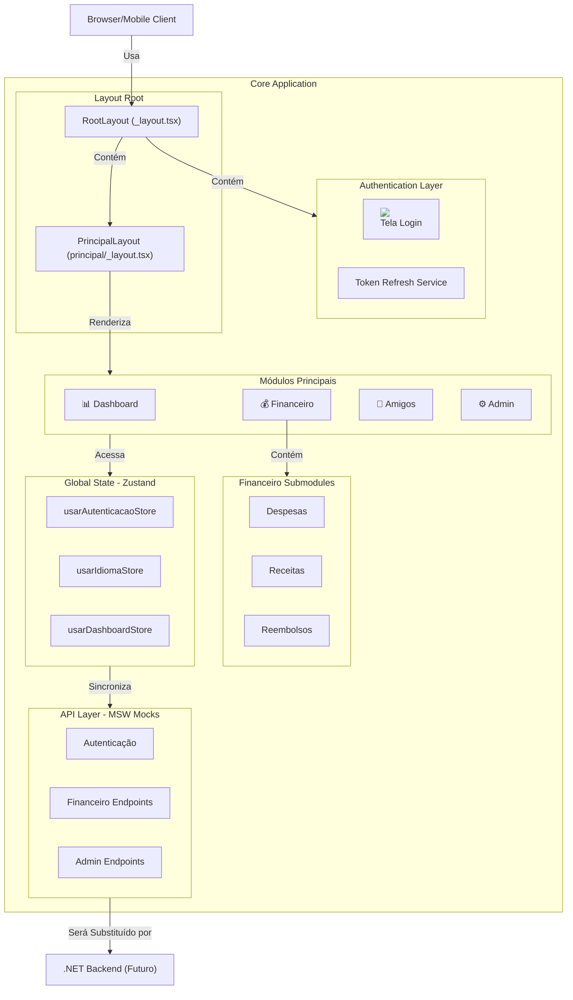
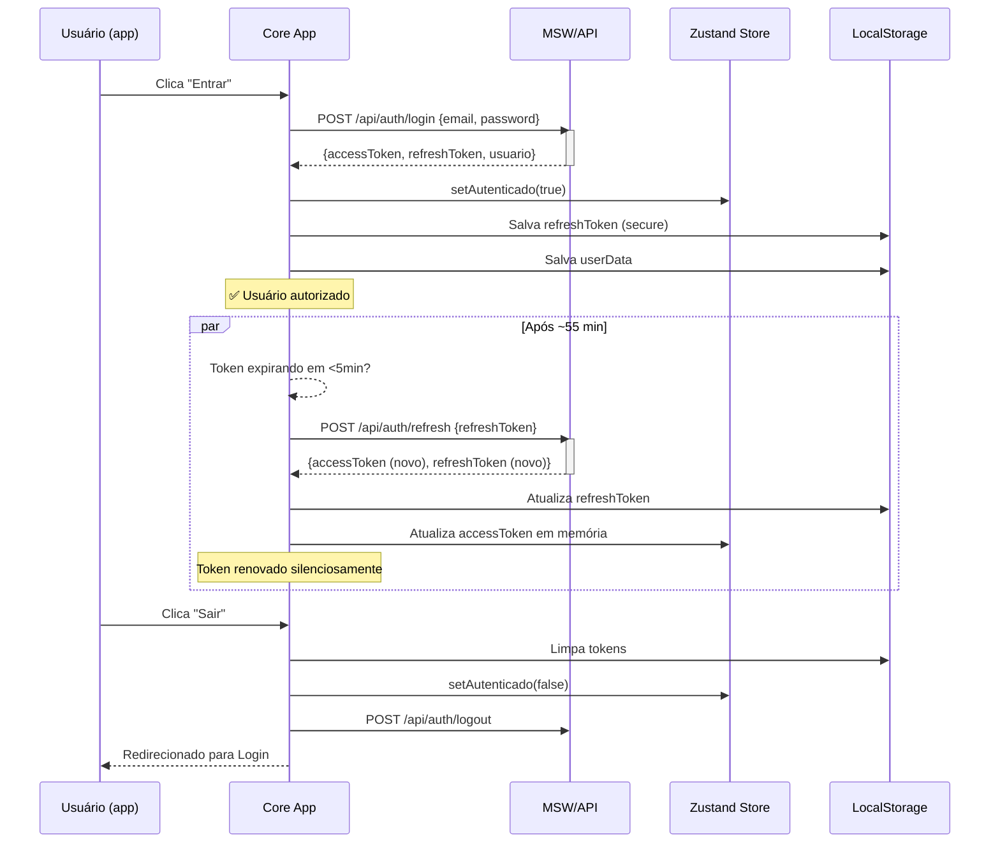
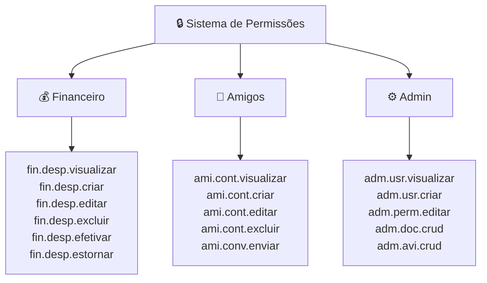

# Manual Técnico - Core

## Índice
1. [Arquitetura Geral](#arquitetura-geral)
2. [Diagrama de Componentes](#diagrama-de-componentes)
3. [Fluxo de Autenticação](#fluxo-de-autenticação)
4. [Stores Zustand](#stores-zustand)
5. [Contratos de API](#contratos-de-api)
6. [Sistema de Permissões](#sistema-de-permissões)
7. [Componente SeletorAmigos](#componente-selectoramigos)
8. [Validações CPF e CNPJ](#validações-cpf-e-cnpj)
9. [Adicionar Novo Módulo](#adicionar-novo-módulo)
10. [Adicionar Nova Tradução](#adicionar-nova-tradução)

---

## Arquitetura Geral

### Decisões Técnicas Justificadas

#### 1. React Native + Expo
**Justificativa:** 
- Código único para web (Expo Web) + iOS + Android
- Managed workflow elimina complexidade nativa
- Hot reload acelera desenvolvimento

#### 2. TypeScript Strict Mode
**Justificativa:**
- Previne bugs em tempo de compilação
- Documenta intenções via tipos
- Refatorações seguras

#### 3. Zustand sobre Redux
**Justificativa:**
- API mais simples (60% menos boilerplate)
- Sem provider hell
- Middleware nativo para persistência

#### 4. MSW (Mock Service Worker)
**Justificativa:**
- Permite desenvolvimento sem backend
- Testes isolados do servidor
- Reutilizável em testes automatizados

#### 5. Sem Tailwind/NativeWind (apenas inline styles)
**Justificativa:**
- Evita conflitos com Babel em React Native
- Styles objects são isomórficos web/mobile
- Performance previsível

#### 6. i18n Hook Customizado (não i18next)
**Justificativa:**
- Reduz dependências externas
- Flexível para mock em testes
- Leve (~2KB)

### Stack Final
```
┌─────────────────────────────────────┐
│    React Native + Expo (Base)       │
├─────────────────────────────────────┤
│ Expo Router (Routing)               │
│ Zustand (State)                     │
│ MSW (API Mocking)                   │
│ TypeScript Strict (Types)           │
├─────────────────────────────────────┤
│ Custom i18n Hook | Axios | LocalStore│
└─────────────────────────────────────┘
```

---

## Diagrama de Componentes



---

## Fluxo de Autenticação

### Sequence Diagram: Login + Refresh Token



### Interceptor Axios (Pseudo-código)
```typescript
// src/servicos/api.ts
axiosInstance.interceptors.response.use(
  (response) => response,
  async (error) => {
    if (error.response?.status === 401) {
      // Token expirado
      const newAccessToken = await refreshToken();
      error.config.headers.Authorization = `Bearer ${newAccessToken}`;
      return axiosInstance(error.config); // Retry
    }
    throw error;
  }
);
```

---

## Stores Zustand

### 1. AuthStore (usarAutenticacaoStore)

```typescript
interface EstadoAutenticacao {
  autenticado: boolean;
  usuario: Usuario | null;
  accessToken: string | null;
  
  // Ações
  setAutenticado(bool): void;
  setUsuario(usuario): void;
  setAccessToken(token): void;
  limpar(): void;
}

const usarAutenticacaoStore = create<EstadoAutenticacao>(
  persist(
    (set) => ({
      // State
      autenticado: false,
      usuario: null,
      accessToken: null,
      
      // Actions
      setAutenticado: (bool) => set({ autenticado: bool }),
      setUsuario: (usuario) => set({ usuario }),
      setAccessToken: (token) => set({ accessToken: token }),
      limpar: () => set({ 
        autenticado: false, 
        usuario: null, 
        accessToken: null 
      }),
    }),
    { 
      name: 'auth-storage',
      storage: sessionStorage // Só durante sessão
    }
  )
);
```

### 2. IdiomaStore (usarIdiomaStore)

```typescript
interface EstadoIdioma {
  idiomaAtual: 'pt-BR' | 'en' | 'es';
  
  mudarIdioma(idioma): void;
}

const usarIdiomaStore = create<EstadoIdioma>(
  persist(
    (set) => ({
      idiomaAtual: 'pt-BR',
      mudarIdioma: (idioma) => set({ idiomaAtual: idioma }),
    }),
    {
      name: 'idioma-storage',
      storage: localStorage // Persistir entre sessões
    }
  )
);
```

### 3. DashboardStore (usarDashboardStore)

```typescript
interface EstadoDashboard {
  ordmemWidgets: string[]; // IDs dos widgets
  colunasVisiveis: Record<string, boolean>; // Tabelas
  filtrosGlobais: FiltrosGlobais;
  
  reordenarWidgets(novaOrdem): void;
  toggleColuna(tabela, coluna): void;
  setFiltros(filtros): void;
}

const usarDashboardStore = create<EstadoDashboard>(
  persist(
    (set) => ({
      ordemWidgets: ['saldo', 'transacoes', 'amigos'],
      colunasVisiveis: {
        tabelaTransacoes: { data: true, valor: true, status: true },
      },
      filtrosGlobais: {},
      
      reordenarWidgets: (novaOrdem) => set({ ordemWidgets: novaOrdem }),
      toggleColuna: (tabela, coluna) => set((state) => ({
        colunasVisiveis: {
          ...state.colunasVisiveis,
          [tabela]: {
            ...state.colunasVisiveis[tabela],
            [coluna]: !state.colunasVisiveis[tabela][coluna],
          }
        }
      })),
      setFiltros: (filtros) => set({ filtrosGlobais: filtros }),
    }),
    { name: 'dashboard-storage' }
  )
);
```

---

## Contratos de API

### 1. Autenticação

#### `POST /api/auth/login`
```typescript
// Request
{
  "email": "usuario@example.com",
  "senha": "senha123"
}

// Response 200 OK
{
  "sucesso": true,
  "dados": {
    "accessToken": "eyJhbGciOiJIUzI1NiIs...",
    "refreshToken": "rt_abc123def456...",
    "usuario": {
      "id": 1,
      "nome": "João Silva",
      "email": "joao@example.com",
      "perfil": "USER",
      "criadoEm": "2024-01-01T10:00:00Z"
    }
  },
  "mensagem": "Login realizado com sucesso"
}

// Response 401 Unauthorized
{
  "sucesso": false,
  "mensagem": "E-mail ou senha inválidos"
}
```

#### `POST /api/auth/refresh`
```typescript
// Request
{
  "refreshToken": "rt_abc123def456..."
}

// Response 200 OK
{
  "sucesso": true,
  "dados": {
    "accessToken": "eyJhbGciOiJIUzI1NiIs...", // NOVO token
    "refreshToken": "rt_xyz789uvw012..." // NOVO refresh token
  }
}

// Response 401 Unauthorized
{
  "sucesso": false,
  "mensagem": "Refresh token expirado. Faça login novamente."
}
```

### 2. Financeiro

#### `GET /api/financeiro/despesas`
```typescript
// Response 200 OK
{
  "sucesso": true,
  "dados": [
    {
      "id": 1,
      "descricao": "Almoço",
      "valor": 45.50,
      "data": "2024-03-15",
      "categoria": "ALIMENTACAO",
      "tipoPagamento": "CARTAO",
      "status": "CONFIRMADA",
      "usuarioId": 1,
      "criadoEm": "2024-03-15T12:00:00Z"
    }
  ],
  "quantidade": 1
}
```

#### `POST /api/financeiro/despesas`
```typescript
// Request
{
  "descricao": "Almoço",
  "valor": 45.50,
  "data": "2024-03-15",
  "categoria": "ALIMENTACAO",
  "tipoPagamento": "CARTAO",
  "participantes": [
    { "usuarioId": 1, "percentual": 50 },
    { "usuarioId": 2, "percentual": 50 }
  ]
}

// Response 201 Created
{
  "sucesso": true,
  "dados": {
    "id": 1,
    // ... mesmos campos + id gerado
  },
  "mensagem": "Despesa criada com sucesso"
}
```

### 3. Reembolsos

#### `POST /api/financeiro/reembolsos`
```typescript
// Request
{
  "descricao": "Pague almoço de hoje",
  "despesasVinculadas": [1, 2], // IDs das despesas
  "destinatarioId": 2
}

// Response 201 Created
{
  "sucesso": true,
  "dados": {
    "id": 10,
    "descricao": "Pague almoço de hoje",
    "valorTotal": 91.00, // Auto-calculado
    "status": "AGUARDANDO",
    "despesasVinculadas": [
      { "id": 1, "valor": 45.50 },
      { "id": 2, "valor": 45.50 }
    ],
    "criadoEm": "2024-03-15T13:00:00Z"
  }
}
```

### 4. Admin - Permissões

#### `GET /api/admin/permissoes`
```typescript
// Response 200 OK
{
  "sucesso": true,
  "dados": {
    "modulos": [
      {
        "nome": "Financeiro",
        "expandido": true,
        "permissoes": [
          { "id": "fin.desp.visualizar", "acao": "Visualizar Despesas", "ativo": true },
          { "id": "fin.desp.criar", "acao": "Criar Despesas", "ativo": true },
          // ...
        ]
      },
      // ... outros modulos
    ]
  }
}
```

#### `POST /api/admin/permissoes`
```typescript
// Request
{
  "modulos": {
    "financeiro": {
      "permissoes": [
        { "id": "fin.desp.visualizar", "ativo": true },
        { "id": "fin.desp.criar", "ativo": false }
      ]
    }
  }
}

// Response 200 OK
{
  "sucesso": true,
  "mensagem": "Permissões atualizadas com sucesso"
}
```

### 5. Admin - Documentos

#### `GET /api/admin/documentos`
```typescript
// Response 200 OK
{
  "sucesso": true,
  "dados": [
    {
      "id": 1,
      "titulo": "Política de Privacidade",
      "tipo": "PDF",
      "status": "PUBLICADO",
      "versoes": 2,
      "criadoPor": "Admin User",
      "dataCriacao": "2024-02-15T08:00:00Z"
    }
  ],
  "quantidade": 1
}
```

#### `POST /api/admin/documentos`
```typescript
// Request (multipart/form-data)
{
  "titulo": "Novo Documento",
  "descricao": "Descrição",
  "arquivo": File,
  "status": "RASCUNHO"
}

// Response 201 Created
{
  "sucesso": true,
  "dados": {
    "id": 2,
    "titulo": "Novo Documento",
    "versoes": [
      {
        "numero": 1,
        "data": "2024-03-15T10:00:00Z",
        "alteracoes": "Versão inicial"
      }
    ]
  }
}
```

### 6. Admin - Avisos

#### `GET /api/admin/avisos`
```typescript
// Response 200 OK
{
  "sucesso": true,
  "dados": [
    {
      "id": 1,
      "titulo": "Manutenção Programada",
      "tipo": "AVISO",
      "status": "PUBLICADO",
      "requerCiencia": true,
      "ciencias": 145, // Usuários que leram
      "totalDestinatarios": 150,
      "criadoPor": "Admin User",
      "dataCriacao": "2024-03-10T14:00:00Z"
    }
  ]
}
```

#### `POST /api/admin/avisos/{id}/publicar`
```typescript
// Response 200 OK
{
  "sucesso": true,
  "mensagem": "Aviso publicado com sucesso",
  "dados": {
    "id": 1,
    "status": "PUBLICADO",
    "dataPublicacao": "2024-03-15T10:00:00Z"
  }
}
```

---

## Sistema de Permissões

### Hierarquia de Módulos



### Herança e Aplicação

1. **Verificação on Login:**
   ```typescript
   // Hook: src/hooks/usarPermissao.ts
   function usarPermissao(permissaoId: string): boolean {
     const { usuario } = usarAutenticacaoStore();
     return usuario?.permissoes?.includes(permissaoId) ?? false;
   }
   ```

2. **Guard em Rota:**
   ```typescript
   if (!usarPermissao('admin.usuarios.visualizar')) {
     return <TelaAcesoDenegado />;
   }
   ```

3. **Refresh após Mudança:**
   - Admin altera permissões em `/api/admin/permissoes`
   - Mudanças aplicadas no **próximo login** do usuário
   - Aviso é exibido na tela de permissões

---

## Componente SeletorAmigos

### Propósito
Seletor reutilizável para escolher amigos em contextos como:
- Dividir despesa
- Convidar para evento
- Atribuir tarefa

### Uso

```typescript
// Importar
import { SeletorAmigos } from '@/componentes/SeletorAmigos';

// Renderizar
<SeletorAmigos
  selecionados={[1, 3]} // IDs dos amigos
  onSelecionar={(ids) => setSelecionados(ids)}
  multi={true} // Permite múltiplas seleções
  filtro={{ categoria: 'PF' }} // Apenas PF
/>
```

### Props

```typescript
interface SeletorAmigosProps {
  selecionados: number[];
  onSelecionar: (ids: number[]) => void;
  multi?: boolean; // Default: true
  filtro?: {
    categoria?: 'PF' | 'PJ'; // Default: ambas
    status?: 'ATIVO' | 'INATIVO'; // Default: ATIVO
  };
  desabilitados?: number[]; // IDs a desabilitar
}
```

### Integração com Despesa Compartilhada

1. Modal abre com `<SeletorAmigos />`
2. Usuário seleciona amigos
3. Para cada seleção, aparece campo de divisão (igual ou custom)
4. Ao salvar: POST com `participantes: [{ usuarioId, percentual }, ...]`

---

## Validações CPF e CNPJ

### Algoritmo CPF

```typescript
// src/utils/validarCPF.ts

export function validarCPF(cpf: string): boolean {
  // Remove pontuação
  const limpo = cpf.replace(/\D/g, '');
  
  // Must be 11 digits
  if (limpo.length !== 11) return false;
  
  // Can't be all same digits
  if (/^(\d)\1{10}$/.test(limpo)) return false;
  
  // Verify check digits (módulo 11)
  let soma = 0;
  let resto;
  
  for (let i = 1; i <= 9; i++) {
    soma += parseInt(limpo.substring(i - 1, i)) * (11 - i);
  }
  
  resto = (soma * 10) % 11;
  if (resto === 10 || resto === 11) resto = 0;
  if (resto !== parseInt(limpo.substring(9, 10))) return false;
  
  soma = 0;
  for (let i = 1; i <= 10; i++) {
    soma += parseInt(limpo.substring(i - 1, i)) * (12 - i);
  }
  
  resto = (soma * 10) % 11;
  if (resto === 10 || resto === 11) resto = 0;
  if (resto !== parseInt(limpo.substring(10, 11))) return false;
  
  return true;
}

// Casos de teste
console.assert(validarCPF('123.456.789-09') === false); // Inválido
console.assert(validarCPF('111.111.111-11') === false); // Todos iguais
console.assert(validarCPF('123.456.789-87') === true);  // Válido
```

### Algoritmo CNPJ

```typescript
// src/utils/validarCNPJ.ts

export function validarCNPJ(cnpj: string): boolean {
  const limpo = cnpj.replace(/\D/g, '');
  
  if (limpo.length !== 14) return false;
  if (/^(\d)\1{13}$/.test(limpo)) return false;
  
  // Verificar dígito 1
  let tamanho = limpo.length - 2;
  let numeros = limpo.substring(0, tamanho);
  let digitos = limpo.substring(tamanho);
  let soma = 0;
  let pos = tamanho - 7;
  
  for (let i = tamanho; i >= 1; i--) {
    soma += numeros.charAt(tamanho - i) * pos--;
    if (pos < 2) pos = 9;
  }
  
  let resultado = soma % 11 < 2 ? 0 : 11 - (soma % 11);
  if (resultado !== parseInt(digitos.charAt(0))) return false;
  
  // Verificar dígito 2 (similar)
  tamanho = tamanho + 1;
  numeros = limpo.substring(0, tamanho);
  soma = 0;
  pos = tamanho - 7;
  
  for (let i = tamanho; i >= 1; i--) {
    soma += numeros.charAt(tamanho - i) * pos--;
    if (pos < 2) pos = 9;
  }
  
  resultado = soma % 11 < 2 ? 0 : 11 - (soma % 11);
  if (resultado !== parseInt(digitos.charAt(1))) return false;
  
  return true;
}

// Casos de teste
console.assert(validarCNPJ('11.222.333/0001-81') === true);  // Válido
console.assert(validarCNPJ('11.222.333/0001-82') === false); // Inválido
console.assert(validarCNPJ('11.111.111/1111-11') === false); // Todos iguais
```

---

## Adicionar Novo Módulo

### Step-by-Step: Exemplo "Lista de Compras"

#### 1. Criar Estrutura de Pastas
```
src/
├── tipos/
│   └── compras.tipos.ts      [NEW] Interfaces + Enums
├── modulos/
│   └── compras/              [NEW]
│       ├── index.tsx         [NEW] Main screen
│       ├── _layout.tsx       [NEW] Routing
│       ├── novo-item.tsx     [NEW] Form modal
│       └── ...
└── mocks/manipuladores/
    └── compras.mock.ts       [NEW] MSW handlers
```

#### 2. Definir Tipos (`src/tipos/compras.tipos.ts`)
```typescript
export enum StatusItem {
  PENDENTE = 'PENDENTE',
  COMPRADO = 'COMPRADO',
  CANCELADO = 'CANCELADO',
}

export interface InterfaceItemCompra {
  id: number;
  descricao: string;
  categoria: string;
  quantidade: number;
  preco?: number;
  status: StatusItem;
  usuarioId: number;
  dataCriacao: string;
}

export interface InterfaceListaCompras {
  id: number;
  nome: string;
  itens: InterfaceItemCompra[];
  compartilhadaCom?: number[]; // User IDs
  criadoEm: string;
}
```

#### 3. Criar Hook (Zustand Store)
```typescript
// src/hooks/usarListasCompras.ts
import { create } from 'zustand';
import { persist } from 'zustand/middleware';

interface EstadoCompras {
  listas: InterfaceListaCompras[];
  carregando: boolean;
  
  buscarListas(): Promise<void>;
  criarLista(nome: string): Promise<void>;
  adicionarItem(listaId: number, item: Partial<InterfaceItemCompra>): Promise<void>;
}

export const usarListasCompras = create<EstadoCompras>(
  persist(
    (set) => ({
      listas: [],
      carregando: false,
      
      buscarListas: async () => {
        set({ carregando: true });
        try {
          const resp = await fetch('/api/compras/listas');
          const { dados } = await resp.json();
          set({ listas: dados });
        } finally {
          set({ carregando: false });
        }
      },
      
      criarLista: async (nome) => {
        const resp = await fetch('/api/compras/listas', {
          method: 'POST',
          headers: { 'Content-Type': 'application/json' },
          body: JSON.stringify({ nome }),
        });
        const { dados } = await resp.json();
        set((state) => ({ listas: [...state.listas, dados] }));
      },
      
      adicionarItem: async (listaId, item) => {
        // Similar...
      },
    }),
    { name: 'compras-storage' }
  )
);
```

#### 4. Criar Tela Principal (`app/modulos/compras/index.tsx`)
```typescript
export default function PaginaCompras() {
  const { listas, buscarListas } = usarListasCompras();
  
  useEffect(() => {
    buscarListas();
  }, []);
  
  return (
    <View style={{ flex: 1, backgroundColor: '#090909' }}>
      <HeaderComTermoUsoAutomatico titulo="Listas de Compras" />
      <FlatList
        data={listas}
        keyExtractor={(item) => item.id.toString()}
        renderItem={({ item }) => (
          <TouchableOpacity
            onPress={() => router.push(`/compras/${item.id}`)}
          >
            <Text style={{ color: 'white' }}>{item.nome}</Text>
          </TouchableOpacity>
        )}
      />
    </View>
  );
}
```

#### 5. Adicionar Rota em Expo Router (`app/principal/_layout.tsx`)
```typescript
<Stack>
  {/* Existing routes... */}
  
  <Stack.Screen
    name="compras"
    options={{
      title: 'Listas de Compras',
      headerShown: false,
    }}
  />
</Stack>
```

#### 6. Criar Handlers MSW (`src/mocks/manipuladores/compras.mock.ts`)
```typescript
import { http, HttpResponse } from 'msw';

export const manipuladorCompras = [
  http.get('/api/compras/listas', () => {
    return HttpResponse.json({
      sucesso: true,
      dados: [
        {
          id: 1,
          nome: 'Supermercado',
          itens: [
            { id: 1, descricao: 'Leite', status: 'PENDENTE' },
          ],
        },
      ],
    });
  }),
  
  http.post('/api/compras/listas', async ({ request }) => {
    const { nome } = await request.json();
    return HttpResponse.json(
      {
        sucesso: true,
        dados: { id: 2, nome, itens: [] },
      },
      { status: 201 }
    );
  }),
];
```

#### 7. Registrar Mock Handler
```typescript
// src/mocks/handlers.ts
import { manipuladorCompras } from './manipuladores/compras.mock';

export const handlers = [
  ...manipuladorAutenticacao,
  ...manipuladorFinanceiro,
  ...manipuladorAmigos,
  ...manipuladorAdministracao,
  ...manipuladorCompras, // [NEW]
];
```

#### 8. Atualizar Menu Lateral
```typescript
const MODULOS = [
  { id: 'dashboard', titulo: 'Dashboard', icone: '📊', rota: '/principal/dashboard' },
  { id: 'financeiro', titulo: 'Financeiro', icone: '💰', rota: '/principal/financeiro' },
  { id: 'amigos', titulo: 'Amigos', icone: '👥', rota: '/principal/amigos' },
  { id: 'compras', titulo: 'Compras', icone: '🛒', rota: '/principal/compras' }, // [NEW]
  { id: 'admin', titulo: 'Admin', icone: '⚙️', rota: '/principal/administracao' },
];
```

---

## Adicionar Nova Tradução

### Estrutura de Idiomas
```
src/idiomas/
├── pt-BR.json
├── en.json
└── es.json
```

### Passos para Adicionar Nova Língua (ex: Italiano)

#### 1. Criar Arquivo (`src/idiomas/it.json`)
```json
{
  "modulos": {
    "financeiro": "Finanziario",
    "amigos": "Amici",
    "admin": "Amministrazione"
  },
  "botoes": {
    "salvar": "Salva",
    "cancelar": "Annulla",
    "deletar": "Elimina"
  },
  "mensagens": {
    "bemvindo": "Benvenuto in Core",
    "loginSucesso": "Accesso riuscito"
  }
}
```

#### 2. Atualizar Hook (`src/hooks/usarTraducao.ts`)
```typescript
const IDIOMAS = {
  'pt-BR': require('../idiomas/pt-BR.json'),
  'en': require('../idiomas/en.json'),
  'es': require('../idiomas/es.json'),
  'it': require('../idiomas/it.json'), // [NEW]
};

export function usarTraducao() {
  const { idiomaAtual } = usarIdiomaStore();
  const traducoes = IDIOMAS[idiomaAtual] || IDIOMAS['pt-BR'];
  
  const t = (chave: string): string => {
    const partes = chave.split('.');
    let valor: any = traducoes;
    
    for (const parte of partes) {
      valor = valor?.[parte];
    }
    
    return valor || chave;
  };
  
  return { t, idiomaAtual };
}
```

#### 3. Atualizar Seletor de Idioma (`src/componentes/SeletorIdioma.tsx`)
```typescript
const IDIOMAS_DISPONIVEIS = [
  { codigo: 'pt-BR', nome: 'Português', bandeira: '🇧🇷' },
  { codigo: 'en', nome: 'English', bandeira: '🇺🇸' },
  { codigo: 'es', nome: 'Español', bandeira: '🇪🇸' },
  { codigo: 'it', nome: 'Italiano', bandeira: '🇮🇹' }, // [NEW]
];
```

#### 4. Usar em Componentes
```typescript
// Já funciona automaticamente!
const { t } = usarTraducao();

return (
  <View>
    <Text>{t('modulos.financeiro')}</Text> {/* "Finanziario" if it=true */}
  </View>
);
```

---

**Última atualização:** 15 de março de 2026
**Versão:** 1.0
**Mantido por:** Time de Desenvolvimento
